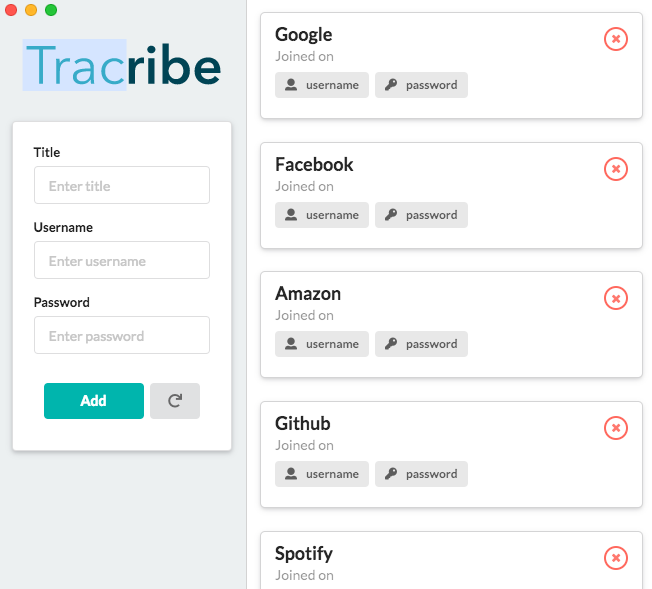

# Tracribe
A desktop utility app allowing the user to store information localy.
It is mainly geared towards storing usernames and passwords, but essentially 
any string formatted data can be stored.

Tracribe works on macOS, Windows, and Linux.

## Requirements
* NodeJS version 8 or higher.

## Quick Build

```sh
npm install
npm run electron-pack
```
This will create both a build(for react) and a dist directory.
Inside the dist directory you will find the Tracribe executable(Currently only for MacOS).

```
tracribe_react
├── public
├── src
├── build
└── dist
  └── mac
    └── Tracribe.app
      └── Tracribe.app
        └── Contents
          └── MacOS
            └── Tracribe
```

### Login Config
In order to set the username and password for the app, change the 
variables in the beginning of the LoginForm.js component.

## Screenshots

<p align='center'>

</p>

<p align='center'>

</p>
